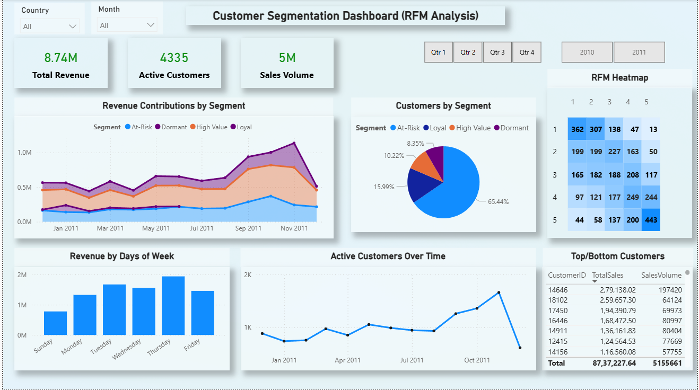

# ECOMMERCE PROJECT
# RFM Analysis for eCommerce Customer Segmentation

This project applies **RFM (Recency, Frequency, Monetary) Analysis** to segment eCommerce customers based on their purchasing behavior, enabling targeted marketing strategies, improved customer retention, and increased customer lifetime value (CLV).

---

## 📌 Project Objective
The objective of this project is to identify meaningful customer segments using RFM analysis so that marketing teams can design personalized campaigns, optimize resource allocation, and improve overall business performance.

---

## 🏢 Business Problem
The eCommerce company faced challenges with:
- Low customer retention
- Ineffective, non-personalized marketing campaigns
- Lack of insights into customer purchasing behavior
- Significant gaps between high-value and low-value customers

---
---

# 📷 Dashboard Preview

---
## 📊 Dataset
- **Type:** eCommerce transactional data
- **Contains:** Customer ID, purchase date, order frequency, and monetary value
- **Format:** CSV / Excel

---

## 🛠️ Tools & Technologies
- **Python**
  - Pandas
  - NumPy
  - Matplotlib
  - Seaborn
- **SQL**
- **Excel**
- **Tableau / Power BI** (for dashboard creation)
- **Jupyter Notebook**

---
